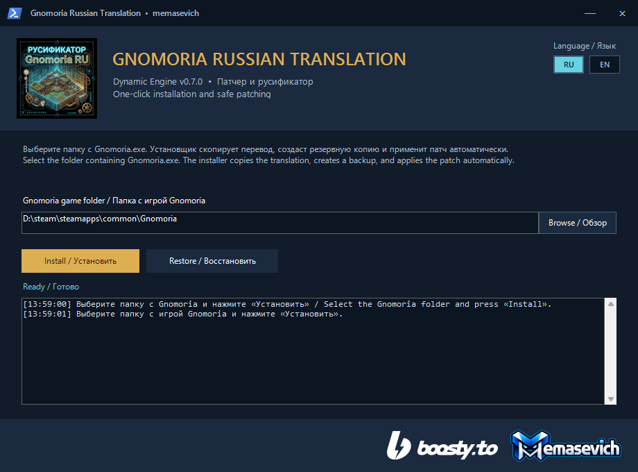
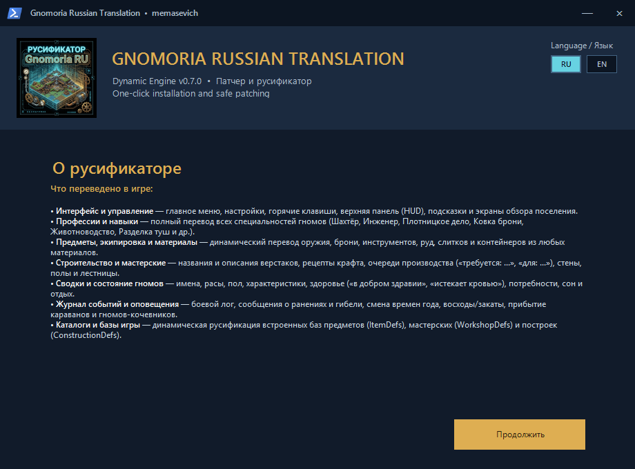
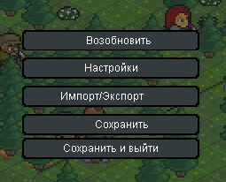
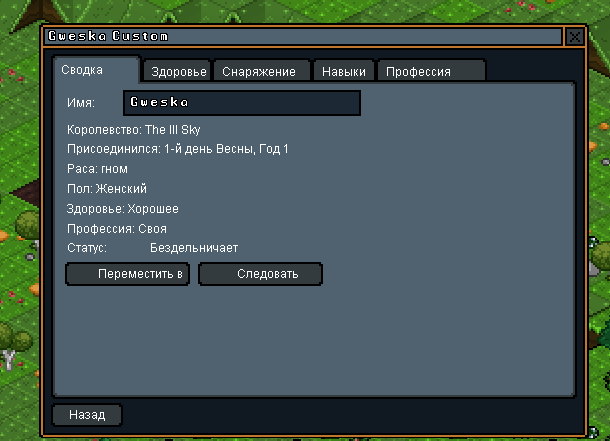
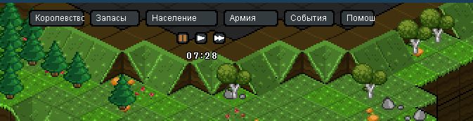

# Gnomoria Russian Translation (Dynamic Engine v0.7.0)

**Разработчик проекта:** [memasevich](https://github.com/memasevich)

[](https://github.com/memasevich/Gnomoria-Russian-Translation/releases/latest)
[](https://github.com/memasevich/Gnomoria-Russian-Translation/releases/latest)
[](tests/ProcessText.Tests.ps1)
[](https://donatepay.ru/don/1497838)

Русификатор для Gnomoria нового поколения, работающий на базе высокопроизводительного динамического перехвата текста и контекстного парсинга.

В отличие от классических русификаторов, данный мод **не требует перерисовки текстур шрифтов или изменения оригинальных XNB-архивов**. Он динамически перехватывает системный вывод графического движка XNA и на лету отрисовывает сглаженную кириллицу.

---

## Быстрая навигация (Оглавление)

* [📥 Быстрый старт: Графический установщик](#графический-установщик-installer-gui)
* [⚙️ Пошаговая инструкция по установке](#инструкция-по-установке)
  * [Способ 1: Автоматический установщик (Рекомендуется)](#способ-1-автоматический-установщик-рекомендуется)
  * [Способ 2: Ручная установка из ZIP-архива](#способ-2-ручная-установка-из-zip-архива)
* [✨ Что переведено в игре (Особенности)](#ключевые-особенности-локализации)
* [🖼️ Скриншоты локализации в игре](#скриншоты-локализации-в-игре-in-game)
* [📂 Структура репозитория](#структура-репозитория)
* [🛠️ Сборка из исходного кода](#сборка-из-исходников)
* [📜 Список изменений](#список-изменений)
  * [Изменения v0.7.0](#изменения-v070)
  * [Изменения v0.6.0](#изменения-v060)
* [⚠️ Известные ограничения](#известные-особенности-и-ограничения)
* [🔧 Решение проблем (Troubleshooting)](#решение-возможных-проблем-troubleshooting)
* [❤️ Поддержка проекта](#поддержка-проекта)

---

## Графический установщик (Installer GUI)

Для максимального удобства разработан автономный установщик с графическим интерфейсом и поддержкой отката:

> 🚀 **[Скачать актуальный установщик (Releases)](https://github.com/memasevich/Gnomoria-Russian-Translation/releases/latest)**





---

## Инструкция по установке:

### Способ 1. Автоматический установщик (Рекомендуется)

> 📥 **Скачать установщик:** перейдите в раздел [**Релизы (Releases)**](https://github.com/memasevich/Gnomoria-Russian-Translation/releases/latest) и скачайте файл **`GnomoriaRussianTranslationInstaller.exe`**.

1. Убедитесь, что игра Gnomoria закрыта.
2. Запустите **`GnomoriaRussianTranslationInstaller.exe`**. Установщик автоматически определит папку с игрой в Steam (при необходимости путь можно указать вручную через кнопку «Browse / Обзор»).
3. Нажмите кнопку **«Install / Установить»**. Установщик самостоятельно:
   * создаст безопасную резервную копию `Gnomoria.exe.backup`;
   * развернет библиотеки мода, актуальный словарь и русские шрифты (`Skin/Fonts`);
   * пропатчит исполняемый файл и активирует поддержку 4GB памяти (Large Address Aware);
   * сохранит полную совместимость с `GnomoriaOptimizer`.
4. Запустите игру. Всё готово!

> **Удаление/Откат к оригиналу:** при необходимости в установщике доступна кнопка **«Restore / Восстановить»**, которая возвращает исходный чистый `Gnomoria.exe` из резервной копии в один клик.

---

### Способ 2. Ручная установка из ZIP-архива

1. Убедитесь, что игра Gnomoria закрыта.
2. Перейдите в раздел [**Релизы (Releases)**](https://github.com/memasevich/Gnomoria-Russian-Translation/releases/latest) и скачайте архив **`Gnomoria_Russian_Translation_v0.7.0.zip`**.
3. Распакуйте все файлы и папку `Skin` в корневую директорию игры (туда, где находится `Gnomoria.exe`).
4. Запустите файл **`Patcher.exe`**. Он выполнит инъекцию хука в `Gnomoria.exe` (оригинал будет сохранён как `Gnomoria.exe.backup`).
5. Запустите игру.

---

## Ключевые особенности локализации:

1. **Глубокая локализация интерфейса:** Полный словарь интерфейса, подсказок, меню и внутриигровых описаний (более **12 000+** выверенных записей).
2. **Алгоритмический парсинг предметов:** Динамический перевод любых инструментов, оружия, брони и деталей из любых материалов:
   * `"copper felling axe"` $\rightarrow$ **«лесорубный топор (медь)»**
   * `"iron great sword"` $\rightarrow$ **«двуручный меч (железо)»**
   * `"leather boots"` $\rightarrow$ **«сапоги (кожа)»**
3. **Контекстный перевод описаний предметов:** Многострочные описания предметов полностью анализируются и переводятся:
   * `"A copper felling axe. Used to fell trees."` $\rightarrow$ **«Лесорубный топор (медь). Используется для рубки деревьев.»**
4. **Динамическая сводка гномов:** Корректный разбор пола, расы, даты вступления в отряд, профессий и королевства:
   * `"Joined: 1st day of Spring, Year 1"` $\rightarrow$ **«Присоединился: 1-й день Весны, Год 1»**
   * `"Gender: Female / Race: Gnome"` $\rightarrow$ **«Пол: Женский / Раса: Гном»**
5. **Локализация окружения:** Перевод всех материалов стен, полов, лестниц и склонов (например, `dirt wall` $\rightarrow$ **«земляная стена»**).
6. **Динамические жидкости:** Поддержка процентов влажности почвы и жидкостей (например, `150% water` $\rightarrow$ **«150% воды»**).

---

## Скриншоты локализации в игре (In-Game):

### Игровое меню:


### Сводка персонажа:


---

## Структура репозитория

```text
├── images/               # Графика, скриншоты интерфейса и окна установщика
├── tests/                # Набор автоматических тестов (ProcessText.Tests.ps1)
├── Patcher/              # Исходный код консольного инъектора (C# / Mono.Cecil)
├── Translator/           # Исходный код движка динамического перевода (C# / Harmony)
├── Gnomoria_en_ru.json   # Централизованный словарь и база данных локализации
├── .gitignore            # Исключения сборок и временных файлов
└── README.md             # Руководство, оглавление, описание и документация
```

---

## Сборка из исходников

Для самостоятельной компиляции проектов требуется [.NET Framework 4.7.2 Developer Pack](https://dotnet.microsoft.com/download/dotnet-framework/net472) или .NET SDK:

```bash
# Сборка библиотеки мода (Translator.dll)
dotnet build Translator/Translator.csproj -c Release

# Сборка консольного патчера (Patcher.exe)
dotnet build Patcher/Patcher.csproj -c Release

# Запуск тестов ProcessText
powershell -File tests/ProcessText.Tests.ps1 -AssemblyPath Translator/bin/Release/net472/Translator.dll -DictionaryPath Gnomoria_en_ru.json
```

---

## Список изменений

### Изменения v0.7.0

- добавлен автономный графический установщик с автоматическим обнаружением игры в Steam и безопасным бэкапом;
- добавлен модуль `DefsPatcher` для динамического перевода встроенных каталогов игры (`ItemDefs`, `WorkshopDefs`, `ConstructionDefs`, `SkillDefs`, `RaceDefs`);
- расширен динамический парсинг очередей крафта, верстаков, боевого лога, событий сна, истощения, смерти и прибытия кочевников;
- обновлен словарь перевода (уточнена терминология ремёсел, добавлены стены и конструкции);
- добавлена поддержка сквозной загрузки (chain-loading) для бесконфликтной работы с `GnomoriaOptimizer`;
- включена автоматическая активация флага Large Address Aware (LAA, 4GB ОЗУ);
- набор автоматических тестов расширен до 46 проверок.

### Изменения v0.6.0

- добавлен динамический перевод счётчиков и статусов интерфейса;
- исправлены динамические шаблоны предметов, контейнеров и количеств;
- обновлён словарь до 12 253 записей;
- релиз подготовлен разработчиком `memasevich` из проверенной private-сборки.

---

## Известные особенности и ограничения:

1. **Выход текста за границы кнопок:** Русский перевод многих слов и фраз значительно длиннее английского оригинала. Из-за фиксированного размера кнопок в оригинальной верстке игры на некоторых элементах интерфейса (например, верхняя HUD-панель управления) длинный русский текст может незначительно выходить за границы кнопок или слегка обрезаться.


2. **Стадия разработки:** База регулярно дополняется новыми алгоритмами и контекстными переводами. Полный словарь насчитывает более 12 000 ключей.

3. **Обратная связь:** Мы всегда открыты для предложений по улучшению локализации, замене терминов и исправлению опечаток. Пишите свои предложения и замечания в комментариях к руководствам в Steam.

---

## Решение возможных проблем (Troubleshooting):

#### 1. Игра не запускается (вылетает или закрывается при старте):
* **Причина:** В папке игры отсутствует один из ключевых файлов зависимостей (`Newtonsoft.Json.dll` или `0Harmony.dll`).
* **Решение:** Воспользуйтесь автоматическим установщиком `GnomoriaRussianTranslationInstaller.exe` — он гарантирует установку всех файлов без ошибок.

#### 2. Патчер (`Patcher.exe`) выдает ошибку при запуске:
* **Причина:** Отсутствует файл библиотеки `Mono.Cecil.dll` либо патчер запущен без прав администратора.
* **Решение:** Убедитесь, что `Mono.Cecil.dll` лежит в папке игры рядом с патчером, кликните правой кнопкой мыши по `Patcher.exe` и выберите **«Запуск от имени администратора»**.

#### 3. Игра запускается, но всё на английском языке:
* **Причина:** Не был выполнен запуск патчера или игра обновилась в Steam.
* **Решение:** Запустите установщик и нажмите «Install» либо выполните повторный запуск `Patcher.exe`.

#### 4. Вместо русских букв отображаются пустые квадраты или каракули:
* **Причина:** Отсутствует или повреждена папка `Skin` (содержит русские шрифты и текстуры интерфейса).
* **Решение:** Установите перевод через автоматический установщик либо скопируйте папку `Skin` из релизного zip-архива.

---

## Поддержка проекта:
Если мод сэкономил вам время, подарил новые эмоции или помог вернуться в любимую игру, вы можете поблагодарить автора за бессонные ночи разработки и поддержать дальнейшие обновления:

[](https://donatepay.ru/don/1497838)

---

**Автор проекта:** [memasevich](https://github.com/memasevich)  
**Версия:** v0.7.0-Dynamic
